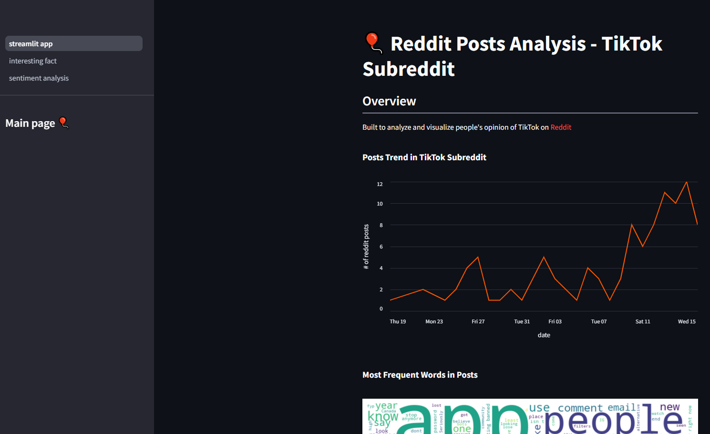
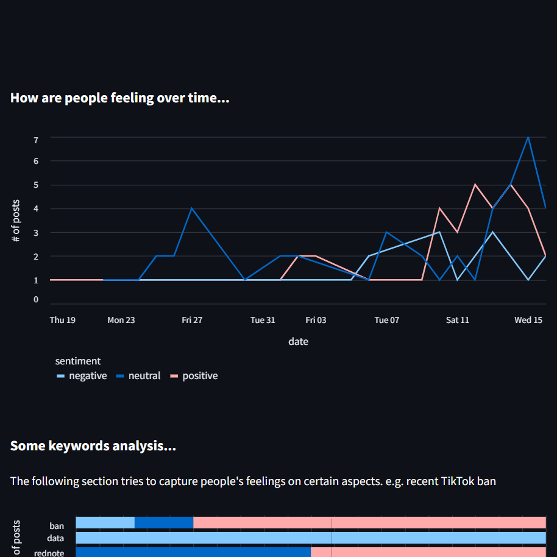
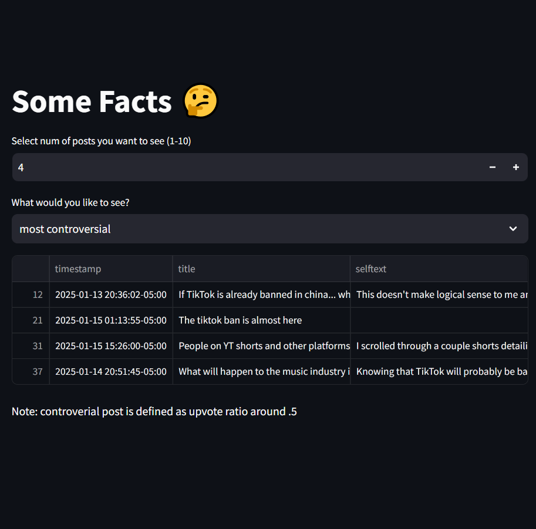

# 🎈 Stramlit Project for Reddit Post Analysis
[](https://blank-app-k14aisqvf6b.streamlit.app/)

Last updated: 1/18/2025

This project is a streamlit project that build a simple app to visualize reddit post trend and understand post sentiment. (you can open the app by clicking 'Open in Streamlit' on left upper conner)

In this repo, I included a sample .json file that I scraped recently from Reddit Tiktok subreddit. Scraping details can be found in this [repo](https://github.com/ychen3407/Reddit-Posts-Analysis.git)

What this streamlit app look like:


<p float="left">
   
  
</p>

Next Step:
1. Scrape more data in the past year to visualize the trend and understand influence of recent TikTok Ban.
2. Streamline data to achieve real-time processing if possible
3. Find better ways to cluster keywords

### How to run it on your own machine

1. Install the requirements

   ```
   $ pip install -r requirements.txt
   ```

2. Run the app

   ```
   $ streamlit run streamlit_app.py
   ```
